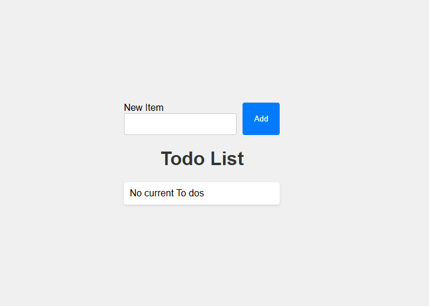

# Todo App

This is a simple Todo application built with React and Vite. The app allows users to add, toggle, and delete todo items. The state of the todos is persisted in the browser's local storage.
simple 
## Features

- **Add Todo**: Users can add new todo items using the input form.
- **Toggle Todo**: Users can mark todo items as completed or incomplete by toggling the checkbox.
- **Delete Todo**: Users can delete todo items from the list.
- **Local Storage**: The state of the todos is saved in the browser's local storage, so the list persists even after refreshing the page.
- **Responsive Design**: The app is styled to be user-friendly and responsive, ensuring a good user experience on different devices.
- **React Hooks**: Utilizes React hooks (`useState` and `useEffect`) for state management and side effects.
- **Component-Based Architecture**: The app is built using a component-based architecture, making it modular and easy to maintain.
- **Vite Integration**: The app is built using Vite, providing fast development and build times.

## Screenshots




## Installation

To run the app locally, follow these steps:

1. Clone the repository.
   ```sh
   git clone https://github.com/your-username/todo-app.git
